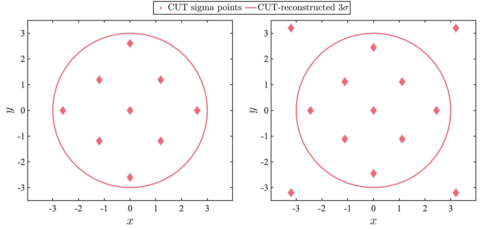
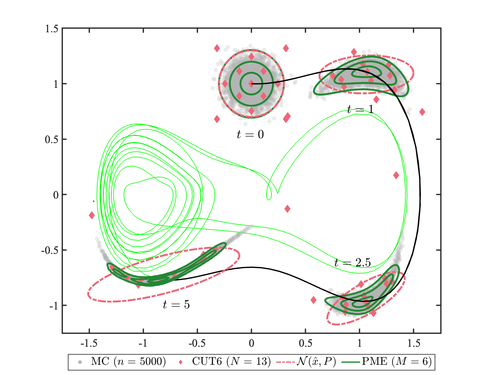

# CUT.m
This MATLAB function generates the conjugate unscented transform (CUT) weighted sigma points following Adurthi et al. [1], both 4th and 6th order.  

$$
\begin{gather}
    Z^(M) \in \mathbb{R}^{N\times d} \\
    W^(M) \in \mathbb{R}^{N\times 1} 
\end{gather}
$$

where $N=2d+2^d+1$ when the order $M=4$ and $N=2d^2+2^d+1$ when the order $M=6$.  

This function is meant to be used in tandem with [plot_corner_pdf.m](https://github.com/bhanson10/plot_corner_pdf), [plot_nongaussian_surface.m](https://github.com/bhanson10/plot_nongaussian_surface), and [plot_gaussian_ellipsoid.m](https://github.com/bhanson10/plot_gaussian_ellipsoid).  

Please direct any questions to blhanson@ucsd.edu.   

## Examples
I provide 4 examples on how to use CUT.m. Here are two figures created from test_CUT_2.m and test_CUT_3.m.

## References
[1] N. Adurthi, P. Singla, and T. Singh, “The conjugate unscented transform—an approach to evaluate multi-dimensional expectation integrals,” in 2012 American Control Conference (ACC), pp. 5556–5561, IEEE, 2012.